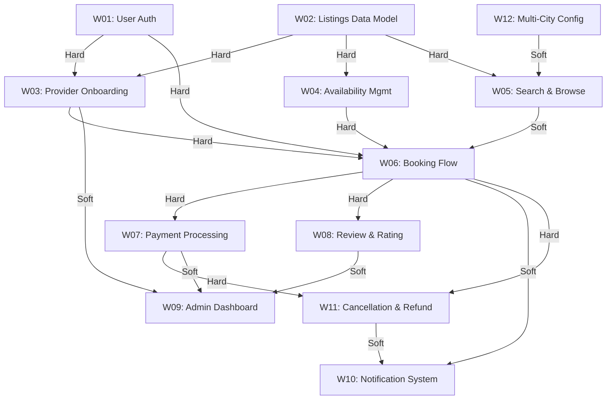

# SkillSwap Dependency Graph (Module 02)

## 1. Buildable Work Items (12 Items)

1. **W01: User Authentication & Accounts** (Registration, login, sessions, JWT/OAuth, user profile base)
2. **W02: Listings & Provider Data Model** (Provider profiles, hourly pricing, service descriptions, category taxonomy, city mapping)
3. **W03: Provider Onboarding & Admin Vetting** (Document submission, verification workflow, approval/rejection state machine)
4. **W04: Availability & Schedule Management** (Slot creation, recurring blocks, calendar integration, buffer times)
5. **W05: Search & Browse Engine** (Category filtering, full-text search, sub-200ms latency optimization)
6. **W06: Booking Flow & Reservation Engine** (Slot selection, atomic reservation lock, booking lifecycle state machine)
7. **W07: Payment Processing & Escrow** (Card capture, 15% platform fee deduction, escrow hold, payout ledger)
8. **W08: Review & Rating System** (Post-session reviews, star ratings rollup, no-show reporting)
9. **W09: Admin & Operations Dashboard** (Provider queue management, dispute escalation, platform telemetry)
10. **W10: Transactional Notification System** (Email/SMS for confirmations, reminders, cancellations)
11. **W11: Cancellation & Refund Flow** (Tiered cancellation logic, escrow refund execution, slot release)
12. **W12: Multi-City Tenancy Configuration** (Geographic cluster partitioning, regional catalog routing)

---

## 2. Dependency Graph Representation

### Mermaid Diagram


### ASCII Graph
```text
+-------------------+    +----------------------------+    +--------------------------+
| W01: User Auth    |    | W02: Listings Data Model   |    | W12: Multi-City Config   |
+---------+---------+    +-------------+--------------+    +------------+-------------+
          |                            |                                |
          | (H)                        +---------------+ (H)            | (S)
          v                                            v                v
+---------+-------------------+              +---------+----------------+---------+
| W03: Provider Onboarding    |              | W05: Search & Browse Engine        |
+---------+-------------------+              +-----------------+------------------+
          |                                                    |
          | (H)         +----------------------------+         | (S)
          |             | W04: Availability Mgmt     |         |
          |             +--------------+-------------+         |
          |                            | (H)                   |
          v                            v                       |
     +----+----------------------------+-----------------------+-----+
     |                     W06: Booking Flow                         |
     +----+----------------------------+-----------------------+-----+
          | (H)                        | (H)                   | (S)
          v                            v                       v
+---------+-----------+      +---------+----------+   +--------+------------------+
| W07: Payment & Escrow|     | W08: Review System |   | W10: Notification Engine |
+---------+-----------+      +---------+----------+   +---------------------------+
          | (H)                        | (S)                   ^
          v                            |                       | (S)
+---------+--------------------+       |                       |
| W11: Cancellation & Refund   +-------+-----------------------+
+---------+--------------------+       |
          | (S)                        |
          v                            v
+---------+----------------------------+----------+
| W09: Admin & Operations Dashboard               |
+-------------------------------------------------+
```

---

## 3. Dependency Classifications

### Hard Dependencies (Solid Constraints)
- `W01 -> W03`: Provider onboarding requires user authentication and accounts.
- `W02 -> W03`: Provider onboarding requires listing profile schema and pricing models.
- `W02 -> W04`: Availability calendar requires provider listing definitions.
- `W02 -> W05`: Search & browse requires listing data schema.
- `W01 -> W06`: Booking requires an authenticated user identity.
- `W03 -> W06`: Booking requires an approved, vetted provider.
- `W04 -> W06`: Booking requires defined time slots to reserve.
- `W06 -> W07`: Payment processing requires an initiated booking payload to authorize funds.
- `W06 -> W08`: Reviews require a completed booking record.
- `W06 -> W11`: Cancellation requires an existing booking reference.
- `W07 -> W11`: Refund execution requires captured payment intent / escrow ledger ID.

### Soft Dependencies (Negotiable / Decoupled via Mocks & Stubs)
- `W12 -> W05`: Multi-city configuration defaults to global single-city filter during initial build.
- `W05 -> W06`: Direct booking can proceed via direct provider URL without search indexing.
- `W06 -> W10`: Booking confirmation notifications can be stubbed with synchronous logs.
- `W11 -> W10`: Cancellation emails can be dispatched asynchronously without blocking refund flow.
- `W03 -> W09`: Admin dashboard can manage onboarding via database triggers / scripts initially.
- `W07 -> W09`: Financial payout aggregation in admin dashboard can run against mock ledgers.
- `W08 -> W09`: Review moderation UI is decoupled from core review submission API.

---

## 4. Starting Points and Leaf Endpoints

### Starting Points (In-Degree = 0)
1. **W01: User Authentication & Accounts**
2. **W02: Listings & Provider Data Model**
3. **W12: Multi-City Tenancy Configuration**
*(These workstreams can commence in parallel on Day 1 without blockers)*

### Leaf Endpoints (Out-Degree = 0)
1. **W09: Admin & Operations Dashboard**
2. **W10: Transactional Notification System**
*(These workstreams consume completed upstream contracts and represent terminal integration layers)*

### Critical Path Analysis
- **Longest Chain (5 Steps)**:
  `W01 / W02` (Day 1-2) -> `W04` (Day 3-4) -> `W06` (Day 5-7) -> `W07` (Day 8-9) -> `W11` (Day 10-11)
- **Minimum Timeline**: 11 working days (sets theoretical lower limit for MVP delivery).
